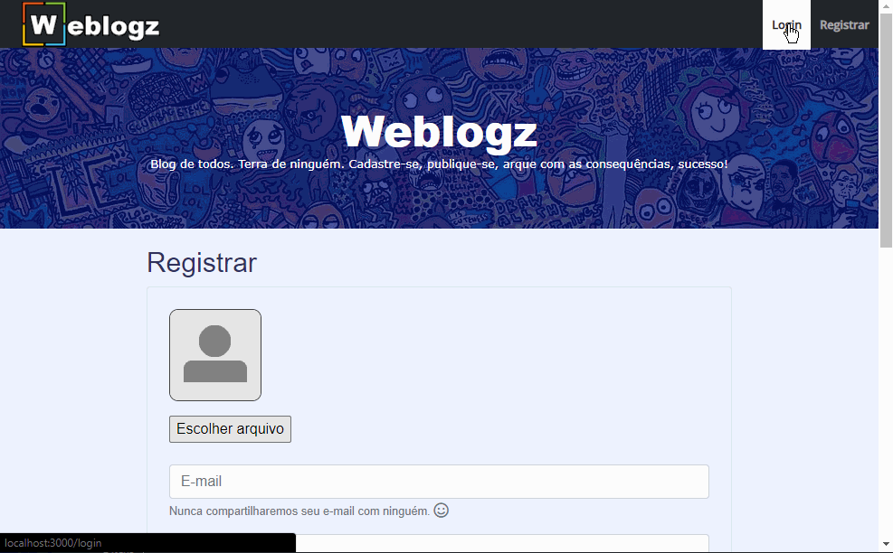
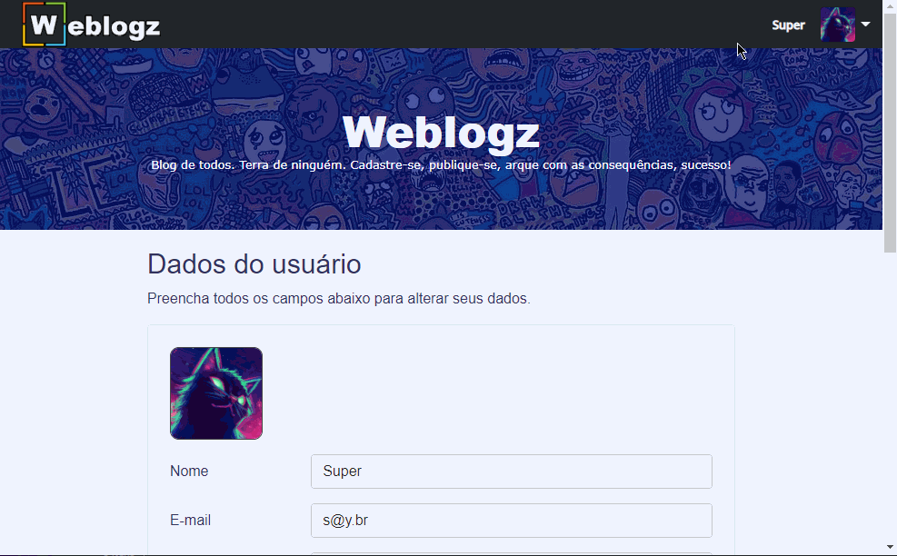

# Weblogz
**Status do Projeto: Em construção.**

## Descrição
Weblogz é um blog com cadastro de usuários, artigos e categorias de artigos. No momento apenas o CRUD de usuários está pronto, incluindo a parte de autenticação e controle de acesso. Tanto no back-end quanto no front-end falta o CRUD de categorias de artigos e de artigos. No front-end falta ainda o estilo (CSS) final. O projeto está sendo desenvolvido com o Node e Express no back-end e React.js no Front-end.

## Pré Requisitos
Pra instalar todas as dependências, lidar com o banco de dados e executar o servidor back-end é necessário ter o Node.js(v14.17.6), o npm(6.14.15) e o Postgresql (13.3) instalados na máquina as versões entre parêntesis foram as utilizadas no projeto. O servidor roda na porta 3005. Para instalar e rodar o front-end é necessário o Node.js e o npm. O front-end roda na porta 3000.

## Instalação
### Back-end
Instalada todas as dependências e utilizando o SGBD Postgresql, para rodar o servidor basta seguir os passos abaixo mas com outros SGBDs como MySQL algumas alterações devem ser necessárias.

Para rodar o servidor:
1- Crie um banco de dados no Postgresql
2- Preencha o arquivo env_file com uma senha qualquer em authSecret, o nome do banco de dados criado, e o usuário e senha para acessá-lo
3- Renomeie o arquivo env_file para .env
4- Pronto. No terminal dentro de /backend execute o comando *npm start* pra executar o servidor.

### Front-end
Com o Node.js e o npm instalados na máquina basta executar um 'npm install' no console/terminal que todas as dependências serão instaladas.

## Como usar
Inicialmente, no back-end devemos criar um usuário administrador diretamente no Postgresql pois pelo nosso servidor somente um usuário administrador tem permissão para criar um usuário administrador. O esquema do usuário é o seguinte:

<pre> Coluna    |           Tipo           | Nullable |            Valor padrão
-----------+--------------------------+-----------+----------+--------------------------
 id        | integer                  | not null | nextval('users_id_seq'::regclass)
 name      | character varying(255)   | not null |
 email     | character varying(255)   | not null |
 password  | character varying(255)   | not null |
 avatar    | character varying(1000)  |          |
 admin     | boolean                  | not null | false
 deletedAt | timestamp with time zone |          |</pre>

Criado um usuário administrador no back-end já podemos logar com ele no front-end e ter acesso a todo o site. O usuário administrador pode criar outros usuários administradores ou não, alterar seu próprio usuário, excluir qualquer usuário inclusive a si próprio mas é recomendado sempre ter ao menos um usuário administrador caso contrário só pelo SGBD será possível criar um usuário administrador. Pela URL pública de cadastro só são criados usuários comuns.

Usuários comuns tem acesso ao editor de texto (pra escrever os artigos futuramente) e a página /home que é onde eles podem editar seu próprio cadastro apenas.

Usuários administradores também tem acesso a página de administração de usuários onde é listado todos os usuários cadastrados e podem criar, alterar e deletar qualquer usuário incluindo a si próprios.

## Screenshots
<h4>Introdução</h4>

<h4>Perfil de usuário</h4>

<h4>CRUD de usuário</h4>

## Tecnologias
As seguintes ferramentas foram usadas na construção do projeto:
- VS Code
- Postman
- Node.js e npm
- Javascript, HTML e CSS
- Express
- SQL/Knex/Postgresql
- JSON Web Token
- React.js
- Draft Wysiwyg
- React Router
- Bootstrap

## Autor
Desenvolvido por Bruno Borges Gontijo, entre em contato.

 

## Licença
MIT © [Bruno Borges Gontijo](https://bruno2077.github.io)